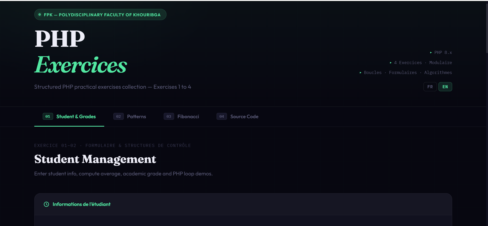
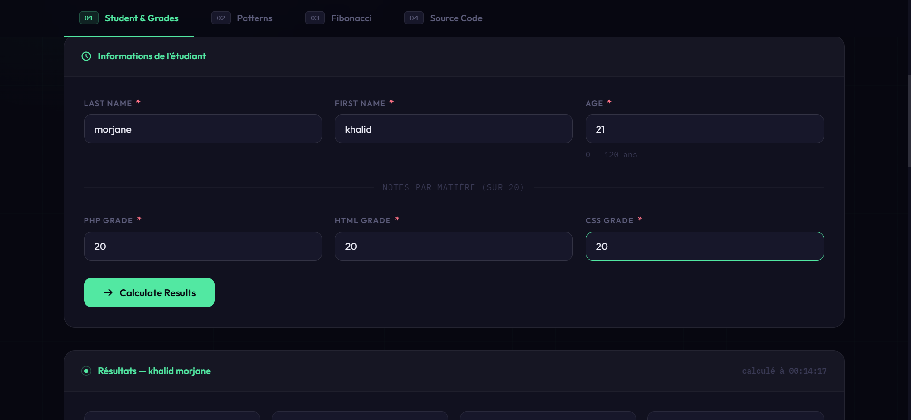
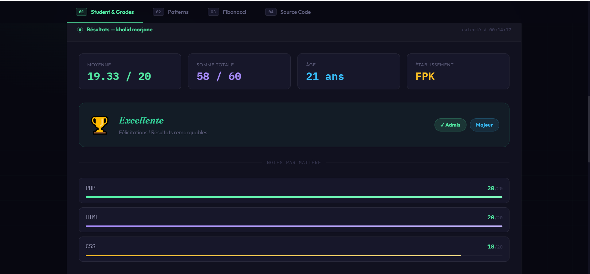
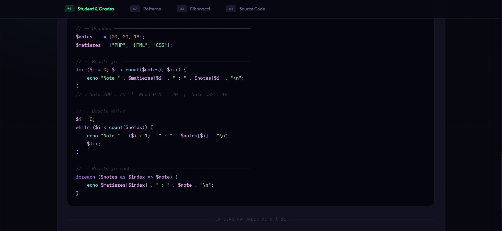
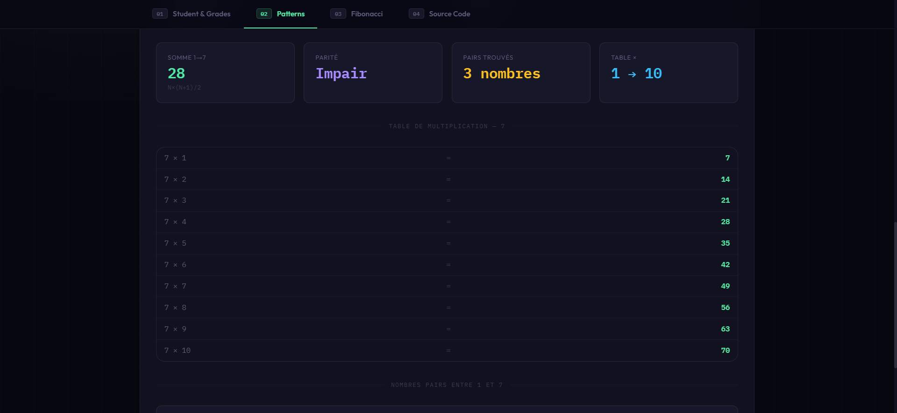
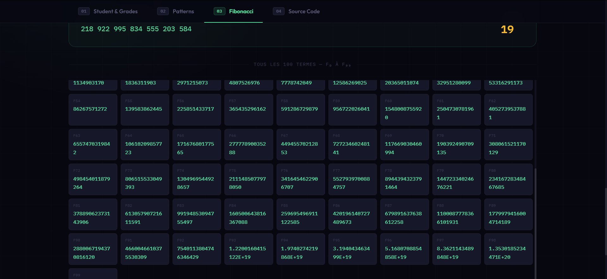
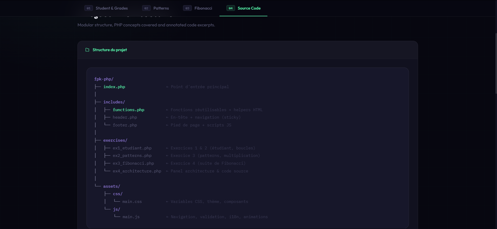

# 🎓 PHP Exercises — Academic Web Project

> **Structured PHP Exercises Platform**  
> A modern, modular, and professional PHP web application designed for academic practice and learning.


---

# 📸 Project Preview



---

# 📌 Overview

This project is a **structured PHP exercises platform** designed for academic learning and demonstration.

It includes multiple exercises focusing on:

- PHP fundamentals
- Loops and conditions
- Pattern generation
- Algorithms
- Session management
- Clean UI/UX

The project follows **modern web architecture** and **modular PHP design**.

---

# ✨ Features

✔ Clean and modern UI  
✔ Modular PHP architecture  
✔ Professional CSS styling  
✔ Pattern generator (Triangle / Square)  
✔ Fibonacci generator  
✔ Student grading system  
✔ Multiplication tables  
✔ Session handling  
✔ Responsive layout  
✔ Clean code structure  

---

# 🧠 Exercises Included

## 📘 Exercise 1 — Student System

- Student grades
- Average calculation
- Mention generation
- Statistics display

---

## 🔺 Exercise 2 — Patterns Generator

- Triangle pattern
- Square pattern
- Multiplication table
- Even numbers
- Sum calculation

---

## 🔢 Exercise 3 — Fibonacci

- Fibonacci sequence generator
- Clean display
- Algorithm demonstration

---

## 🏗 Exercise 4 — Architecture

- System architecture demonstration
- Modular PHP structure

---

# 🗂 Project Structure

```
php-academic-suite/
│
│   index.php
│
├── assets
│   ├── css
│   │   └── main.css
│   └── js
│       └── main.js
│
├── exercises
│   ├── ex1_etudiant.php
│   ├── ex2_patterns.php
│   ├── ex3_fibonacci.php
│   └── ex4_architecture.php
│
|── includes
|   ├── header.php
|   ├── footer.php
|   └── functions.php
|
└── screenshots/
    ├── home.png
    ├── ex1_1.png
    ├── ex1_2.png
    ├── ex1_3.png
    ├── architecture.png
    └── patterns.png
```

---

# ⭐ Demo

## 🔗 Local Demo

Run locally:

```
http://localhost/php-academic-suite
```

---

# 📸 Screenshots

## 🏠 Home Interface


---

## 🎓 Student System





---

## 🔺 Pattern Generator



---

## 🔢 Fibonacci Generator



---

## 🏗 Architecture Section



---


# ⚙️ Requirements

- PHP 8.x
- Apache (XAMPP recommended)
- Browser

---

# 🚀 Installation

Clone repository:

```
git clone https://github.com/YOUR_USERNAME/php-academic-suite.git
```

Move to:

```
C:\xampp\htdocs\
```

Open:

```
http://localhost/php-academic-suite
```

---

# 🧩 Technologies

- PHP
- HTML
- CSS
- JavaScript
- XAMPP

---

# 🧑‍💻 Author

**Khalid Morjane**  
Information Systems & AI Student

---

# 🎓 Academic Context

FPK — Faculté Polydisciplinaire Khouribga

---

# ⭐ If you like this project

Give it a ⭐ on GitHub
